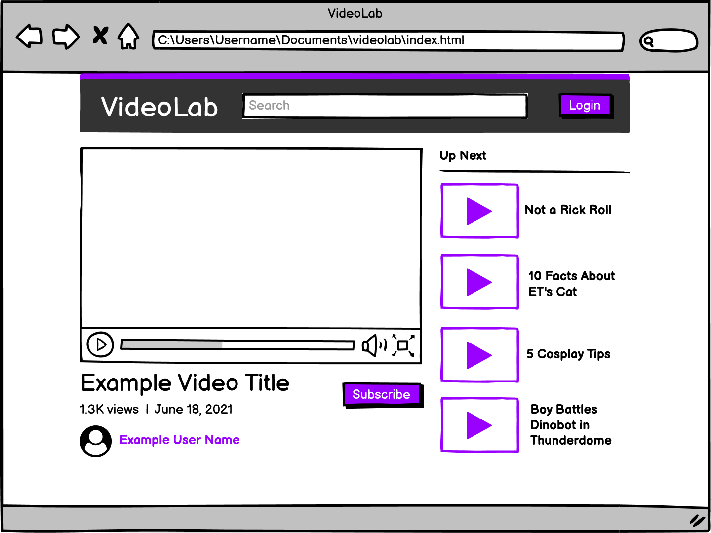

# Video Preview

#### Objectives

- Practice using `onmouseover` and `onmouseout`
- Practice working from an existing code base

For this assignment we'll be working with some existing code (download here) to add a video in. We'll want to find a free video that we want to work with from [https://www.pexels.com/videos/]. Next, we'll want to add the video into a video tag in the **HTML**. To make the website more interactive add hover events to play and pause the video when hovering.

### Hints:
We may need to make use of the `.play()` and `.pause()` methods - reference [https://www.w3schools.com/jsref/dom_obj_video.asp]

We may also need the video to be `muted` as modern browsers want users to interact with (click) videos for them to start playing.

- [x] Add a <video> into the existing project

- [x] When hovering the video it should preview the content by playing the video on mute

Here is an example of mine. You'll need to download the repository to see the video in action. 

